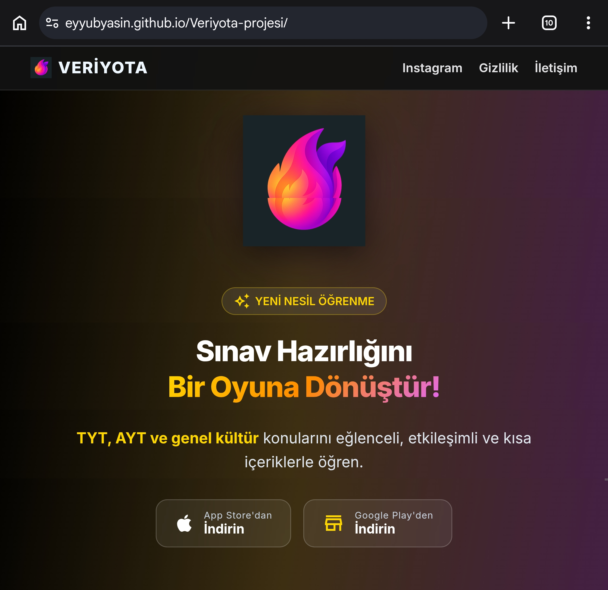

# Kisisel-platform
Bu projemde beni tanıtan ve projelerimi sunduğum kendime özgü bir site tasarladım.

# ⚡ EYYÜB — Personal Portfolio & Platform

> Estetik, hız ve brutalist minimalizmi bir araya getirerek web deneyimleri inşa eden bağımsız geliştiricinin kişisel portfolyo platformu.



---

## 🚀 Öne Çıkan Özellikler (Features)

* **🎨 Brutalist & Minimalist Tasarım:** Koyu tema (`#0a0a0a`), neon sarı/yeşil vurgu tonları (`#d9ff43`) ve keskin tipografi (`Plus Jakarta Sans` & `Space Mono`).
* **🌟 Özel Yıldız Işığı Fare İmleci (Custom Cursor):** Masaüstü cihazlarda fare hareketini takip eden dinamik ışık ve süzülen yıldız parçacığı efektleri.
* **✨ 3D Tilt & Interactive Spotlight:** Proje kartları, felsefe alanı ve yetenek satırlarında fare hareketine göre milimetrik 3D eğilme ve neon parıltı takibi.
* **📊 Dinamik Scroll & Metin Efektleri:**
  * **Scrollspy:** Kaydırma esnasında o an bulunan bölümün üst menüde otomatik yanması.
  * **Parallax Text:** Sayfa indirildikçe sağa doğru akan dinamik metinler.
  * **Scroll Reveal:** Elemanların ekrana girdikçe aşağıdan yukarı süzülerek belirmesi.
* **🛡️ Güvenlik & Sistem Bildirim Kutusu (Toast System):**
  * Bağlantı kesildiğinde / geldiğinde çıkan brutalist uyarı banner'ları.
  * Yavaş bağlantı (2G/3G) algılama.
  * Sayfa çökmesini engelleyen global JS hata yakalayıcı.
  * Görsel sürükleme (`dragstart`) ve izinsiz kod kopyalama engeli.
* **📱 Tam Responsive & Dokunmatik Koruma:** Mobil ve tablet ekranlarda pürüzsüz dokunmatik deneyimi için özelleştirilmiş duyarlı mimari.

---

## 🛠️ Kullanılan Teknolojiler (Tech Stack)

* **HTML5:** Semantik, SEO uyumlu ve erişilebilir sayfa yapısı.
* **CSS3:** Flexbox, CSS Grid, Custom Variables, Keyframe Animations, 3D Transforms & Glassmorphism.
* **JavaScript (Vanilla ES6+):** Harici kütüphane kullanılmadan yazılmış Intersection Observer API, Network Information API ve asenkron DOM kontrolcüleri.
* **Google Fonts:** *Plus Jakarta Sans* & *Space Mono*.

---

## 📂 Proje Yapısı (Directory Structure)

```text
.
├── index.html        # Ana HTML dokümanı (İçerik, Modallar & JS)
├── style.css         # Tüm responsive stiller, animasyonlar & değişkenler
├── proje1.png        # Proje ön izleme görselleri
└── README.md         # Proje dokümantasyonu
